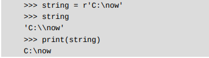

> Life is short. You need Python。
>                                       ——Bruce Eckel

> 只有勇敢地割掉与时代发展不相符的瑕疵部分，才能
>缔造出真正的完美体验！
<!-- toc -->
# python学英语
变量(variable) 字符串(str) 元祖(tuple)
# 前提
本资料均来自课程和网上查找 且仅展示我不熟悉的知识点 (会在不同程度上补充)
# 2023/7/22
## .py文件怎么运行?
将python设为全局变量
在cmd窗口中python .py文件所在路径即可
手机termux中可以用pkg install python(最好先安装tsu)
## windows的python文件怎样更新
暂时不想升级~~逃避逃避~~
## 显示所有python内置函数(BIF)
`dir(__builtins__)`
## python特殊字符输入方法
1. 使用转义符号（\）对字符串中的引号进行转义
2. 只需要在字符串前边加一个英文字母r即可
<!--more-->

1. 无论是否为原始字符串，都不能以反斜杠作为结尾（注：反斜杠放在字符串的末尾表示该字符串还没有结束，换行继续的意思)
解决方法用\转义
## 小技巧
1. 输入长文本时可以用`"""长文本"""`进行输入(当然也可以用`\n`在换行时)但是文本比较多是就麻烦了
### True + True
`True + True =2`直接运行是错的
但是输入`True + True`回车时是2
1,2输出后是(1,2)
字符串输出后带''但是print后没有
## 类型判断
1. type告诉你何种类型 `type`
2. 判断某个字符是否为某种类型 `isinstance`
## idle清屏方法
参考[真实可行的Python清屏命令](https://blog.csdn.net/cxcxrs/article/details/81219395)
下载文件,更改idle配置
直接ctrl+l就可以清屏
## 断言assert
暂时不懂 但估计和正则表达式中正/反向先/后行断言差不多
例子
`assert 1 <= 3`能执行
`assert 1 >= 3`报错
## 列表
1. list:将列表打印出来
`list(range(10))`
`list("hello")`
1. range(a,b,c)记住左闭右开即可
### 向列表添加元素
1. .append向右添加一个元素
`number.append(6)`
1. .extend可以添加多个元素(简单理解为一个列表在接上一个列表)
`number.extend([8,9])` 
1. .insert可以利用所以在指定位置添加元素
`列表.insert(索引:要插入的位置,要添加的元素)`
`number.insert(0.0)`注意是从0开始数的
还可以是倒数从-1,-2开始不过是倒数
算了,猜错了
是从列表中所以所在元素的前一位
1. 一个不用函数的变换
即令`number[索引] = 一个替换的元素`
可以做到 交换列表中的元素
`eggs[1],eggs[3] = eggs[3],eggs[1]`
### 列表套娃
从列表中获取元素
`eggs = ["鸡蛋","铁蛋",["天鹅蛋","企鹅蛋","加拿大蛋"],"鸭蛋"]`
获取 加拿大蛋
`eggs[2][2]`
### random.choice
从一个非空的列表中随机获取一个元素
`random.choice(prizes)`
### 从列表中删除元素
1. remove方法
`列表.remove(元素名称)`
`eggs.remove("铁蛋")`
1. pop(弹)
1.)列表.pop()会将弹出去的数打印出来,列表弹出对应的数
2.)列白.pop(索引)同理 
1. del(实际上是利用del能够删除变量的特性操作的)
用法`del 列表名[索引]`
`del eggs(0)`
del 变量名(变量,列表之类的)
### 列表切片
1.)`list[元素1的索引:元素2的索引+1]`
list[]是左闭右开的(和range类似)所以终止索引需要+1
`list[2:5]`
2.) 简化写法:`list[:2]`表示从0开始到2结束且不包含2其等价于`list[0:2]`
`list[2:]`表示从2开始,直到最后
`list[:]`表示从开始到结束
3.)步长:默认不输是1 `list[0:9:2]`结果每个相隔2 同时步长可正可负
4.) 利用del和步长删除列表的奇数项`del list1[::2]`
5.) 利用切片进行列表替换 `list[:2]=["超人","神奇女侠"]`可以做到不等长替换
### 列表的运算
1. 列表大小比较:单元素列表将元素转化为Ascall码进行大小比较
2. 多元素列表则先比较第一个元素,如果第一个元素大,则其所在列表更大
3. 列表相加 列表与数字相乘 
4. 判断元素是否在列表内 `"小甲鱼" in list1`or`"小乌龟"not in list1`
5. 综合利用去除某一列表的重复元素

```python
old_list = ["西班牙","葡萄牙","葡萄牙","牙买加","匈牙利"]
new_list = []
for each in old_list:
    if each not in new_list:
        new_list.append(each)
```
### 和列表相关的方法
1. 统计列表中各元素出现的个数`list1.index(1)`
2. 统计列表中指定元素第一次出现的索引`list1.reverse()`
3. 对列表进行倒序输出`list1.reverse()`
4. 对列表正序整理`list1.sort()`
5. 队列表倒序整理`list1.sort(reverse = True)` <--重点
## 元组
### 创建和访问元组
~~tuple一个无厘头的东西~~
1. 特别像列表 支持索引 切片之类的 ,但是不支持利用元组的索引进行替换
```python
tuple1 = (1,2,3,4,5,6,7,8)
type(tuple1)
<class 'tuple'>
tuple1[1]
2
tuple1[5:] # 支持切片
(6, 7, 8)
tuple1[:5]
(1, 2, 3, 4, 5)
tuple2 = tuple1 # 支持复制
tuple2
(1, 2, 3, 4, 5, 6, 7, 8)
```

2. `tuple1[1] = 1`会报错 
3. 创建元组时
```python
tuple1 = (520) #这是int
tuple1 = (520,) #这是元组
tuple1 = 520, # 这是元组
```

总结:`.`是创建元组的关键
### 更新和删除元祖


   
